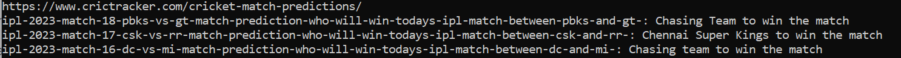
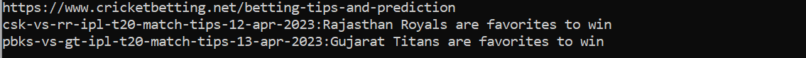
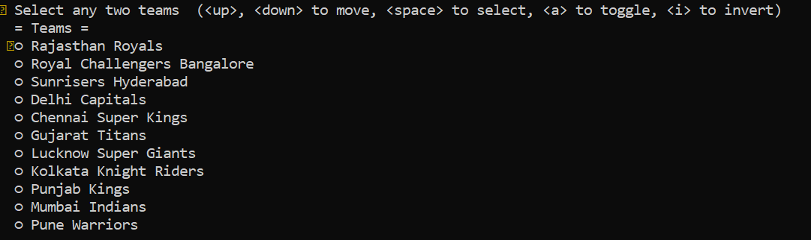

# IPL2023

This script captures the prediction of latest season IPL matches(23) from crictracker.com & cricketbetting.net.
You need to install BeautifulSoup, h2o, PyInquirer

```git clone https://gitlabce.tools.aws.vodafone.com/ml_coe/bailout4.git```

```cd <project path>```

```pip install BeautifulSoup h2o PyInquirer```

then

```python Webscraper.py```

you will get an output similar to this





To get the **match winner** and **toss winner** predictions, run the below script

```python winner_toss_prediction.py```

select two teams by hitting space against the team names and then press enter


